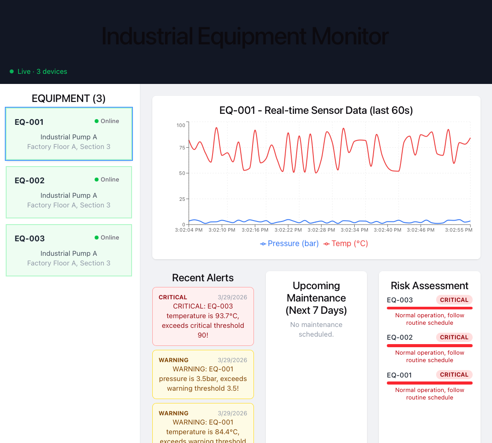

# Equipment Monitor Dashboard

Real-time industrial equipment monitoring dashboard. Companion frontend for the [equipment-monitor backend](../equipment-monitor).

## Screenshots



## Performance Optimizations

| Optimization        | Implementation                               | Impact                             |
| ------------------- | -------------------------------------------- | ---------------------------------- |
| Code splitting      | `React.lazy` + `Suspense` on SensorChart     | Recharts loaded on demand          |
| Manual chunking     | Vite `manualChunks` separating vendor libs   | Initial chunk: 234KB               |
| ETag caching        | `If-None-Match` header in `useFetch`         | 304 responses for unchanged data   |
| Render optimization | `React.memo` on EquipmentCard                | Prevent unnecessary re-renders     |
| Animation disabled  | `isAnimationActive = {false}` on live charts | Eliminates flicker on data updates |

## Tech Stack

React · TypeScript · Vite · Tailwind CSS · Recharts · Axios

## Features

- Live sensor data visualization (updates every 2 seconds)
- Color-coded equipment status indicators
- Active alert panel with WARNING/CRITICAL severity levels
- Upcoming maintenance schedule (next 7 days)
- Risk assessment based on alert patterns

## Architecture Decisions

- **Custom Hook (`useFetch<T>`)**: Generic polling hook with ETag support, used by all data-fetching components
- **Context API**: Global equipment state shared without props drilling
- **`React.memo`**: Prevent unnecessary re-renders of EquipmentCards
- **`React.lazy`**: SensorChart (largest component) loaded when it's first rendered

## Getting started

\```bash
npm install
npm run dev # http://localhost:5173
\```

Backend must be running on port 3001. See equipment-monitor repo.
